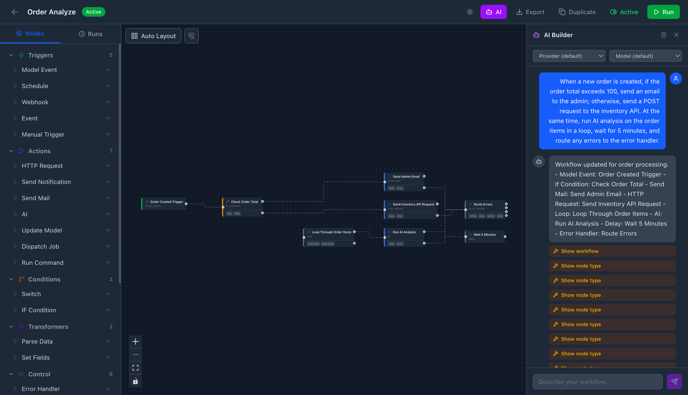

# Laravel Workflow Automation

> [!WARNING]
> Bu paket aktif geliştirme aşamasındadır ve henüz production kullanımı için önerilmemektedir. API'ler, veritabanı şemaları ve özellikler değişebilir.

> **[English](README.md)** | Türkçe

Çok adımlı iş mantığını görsel, yapılandırılabilir graflar olarak tanımlayın — gerisini Laravel halletsin. Kod tabanınıza dağılmış if/else zincirleri, kuyruk işleri ve event listener'lar yerine, tüm akışı bir kez tanımlarsınız: tetikleyici, koşullar, aksiyonlar, döngüler, gecikmeler. Motor çalıştırmayı, yeniden denemeyi, loglama ve insan onayı beklemeyi yönetir. N8N gibi düşünün, ama sahip olduğunuz ve genişletebildiğiniz bir Laravel paketi olarak.

**[Detaylı Dokümantasyon](https://laravel-workflow.pilyus.com)**



## Kurulum

```bash
composer require aftandilmmd/laravel-workflow-automation
php artisan vendor:publish --tag=workflow-automation-config --tag=workflow-automation-migrations
php artisan migrate
```

## Hızlı Başlangıç

Kullanıcı kayıt olunca hoş geldin e-postası gönder:

```php
use Aftandilmmd\WorkflowAutomation\Models\Workflow;

$workflow = Workflow::create(['name' => 'Welcome Email']);

$trigger = $workflow->addNode('User Created', 'model_event', [
    'model'  => 'App\\Models\\User',
    'events' => ['created'],
]);

$email = $workflow->addNode('Send Welcome', 'send_mail', [
    'to'      => '{{ item.email }}',
    'subject' => 'Welcome, {{ item.name }}!',
    'body'    => 'Thanks for signing up.',
]);

$trigger->connect($email);
$workflow->activate();
```

Her `User::create()` çağrısı artık workflow'u otomatik tetikler.

## Özellikler

**Görsel Editör** — React Flow canvas ile sürükle-bırak workflow oluşturucu. Node ekle, portları bağla, formları yapılandır, çalıştır ve izle — hepsi `/workflow-editor` adresinden.

**26 Hazır Node** — Tetikleyiciler, aksiyonlar, koşullar, döngüler, gecikmeler, AI ve daha fazlası. Yaygın otomasyon senaryolarını kod yazmadan, yapı taşları gibi birbirine bağlayarak çözün.

**İfade Motoru** — Herhangi bir config alanında `{{ item.email }}`, aritmetik, ternary ve 30+ hazır fonksiyon kullanın. Özel recursive descent parser — `eval()` yok.

**5 Tetikleyici Tipi** — Workflow'ları manuel olarak, Eloquent model eventlerinde, Laravel eventlerinde, gelen webhook'larda veya cron zamanlamalarında başlatın.

**İnsan Onayı** — Çalışan bir workflow'u duraklatın ve dış onay bekleyin. Kod veya REST API üzerinden istediğiniz payload ile devam ettirin.

**Yeniden Deneme & Tekrar Oynatma** — Başarısız workflow'ları tam hata noktasından yeniden çalıştırın, tamamlanmış çalıştırmaları orijinal payload ile tekrar oynatın veya tek bir node'u yeniden deneyin.

**Özel Node'lar** — `#[AsWorkflowNode]` attribute ile tek bir PHP sınıfı. Giriş/çıkış portlarını, config şemasını ve çalıştırma mantığını tanımlayın — gerisini motor halleder.

**Plugin Sistemi** — Özel node'ları, middleware'leri ve event listener'ları yeniden kullanılabilir plugin'lere dönüştürün. Projeler arasında paylaşın veya Composer paketi olarak yayınlayın.

**Tam REST API** — Herhangi bir frontend, dashboard veya AI agent'tan workflow oluşturun, düzenleyin, çalıştırın ve izleyin. Eksiksiz CRUD, çalıştırma ve registry endpoint'leri.

**Tam Gözlemlenebilirlik** — Her çalıştırma, node bazında giriş/çıkış, süre ve hatalarıyla birlikte kaydedilir. Hataları izleyin, yanıtları debug edin, herhangi bir çalıştırmayı tekrar oynatın.

## Test

```bash
composer test
```

## Lisans

MIT
