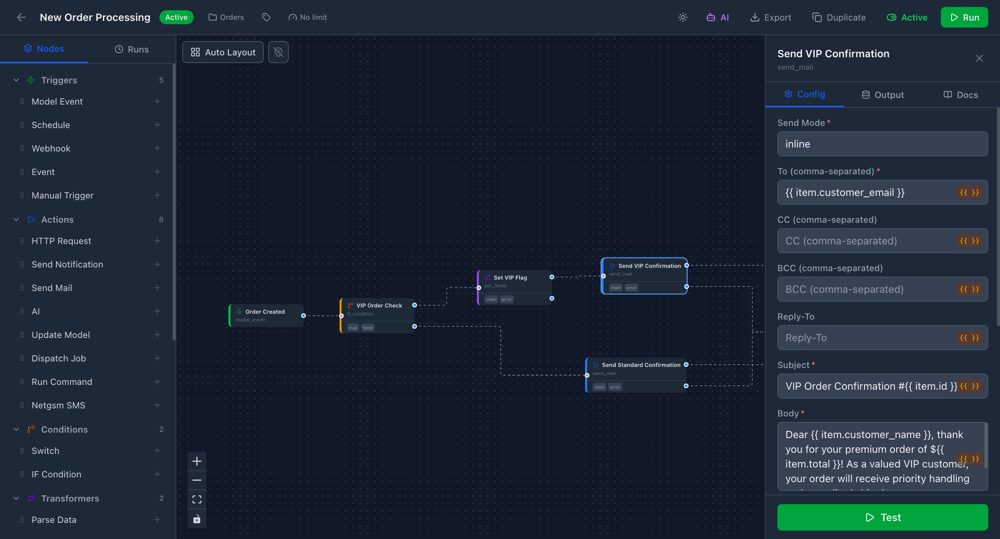
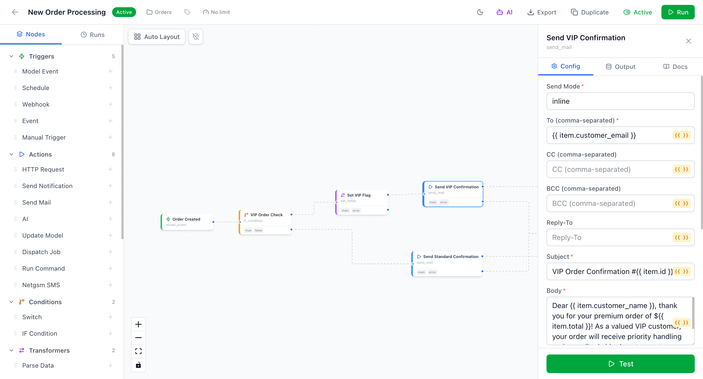

<div v-pre>

# Visual Workflow Editor

The package includes a React-based visual workflow editor that lets you build workflows with a drag-and-drop canvas, configure nodes through dynamic forms, execute workflows, and view run history — all from your browser.

## Quick Start

The editor is available at `/workflow-editor` once the package is installed:

```
http://myapp.test/workflow-editor
```

No extra setup is required — the UI is served directly from the package.

</div>

<div class="browser-mock">
  <div class="browser-chrome">
    <div class="browser-dots">
      <span class="dot dot-red"></span>
      <span class="dot dot-yellow"></span>
      <span class="dot dot-green"></span>
    </div>
    <div class="browser-nav">
      <svg xmlns="http://www.w3.org/2000/svg" width="14" height="14" viewBox="0 0 24 24" fill="none" stroke="currentColor" stroke-width="2" stroke-linecap="round" stroke-linejoin="round"><path d="m15 18-6-6 6-6"/></svg>
      <svg xmlns="http://www.w3.org/2000/svg" width="14" height="14" viewBox="0 0 24 24" fill="none" stroke="currentColor" stroke-width="2" stroke-linecap="round" stroke-linejoin="round"><path d="m9 18 6-6-6-6"/></svg>
      <svg xmlns="http://www.w3.org/2000/svg" width="14" height="14" viewBox="0 0 24 24" fill="none" stroke="currentColor" stroke-width="2" stroke-linecap="round" stroke-linejoin="round"><path d="M21 12a9 9 0 1 1-9-9c2.52 0 4.93 1 6.74 2.74L21 8"/><path d="M21 3v5h-5"/></svg>
    </div>
    <div class="browser-address">
      <svg xmlns="http://www.w3.org/2000/svg" width="12" height="12" viewBox="0 0 24 24" fill="none" stroke="currentColor" stroke-width="2" stroke-linecap="round" stroke-linejoin="round"><rect width="18" height="11" x="3" y="11" rx="2" ry="2"/><path d="M7 11V7a5 5 0 0 1 10 0v4"/></svg>
      <span>myapp.test/workflow-editor</span>
    </div>
  </div>
  
  
</div>

<style>
.browser-mock {
  margin: 1.5rem 0;
  border-radius: 12px;
  overflow: hidden;
  border: 1px solid var(--vp-c-divider);
  box-shadow: 0 8px 40px rgba(0, 0, 0, 0.08);
}
.browser-chrome {
  display: flex;
  align-items: center;
  gap: 12px;
  padding: 10px 16px;
  background: var(--vp-c-bg);
  border-bottom: 1px solid var(--vp-c-divider);
}
.browser-dots {
  display: flex;
  gap: 6px;
  flex-shrink: 0;
}
.dot {
  width: 10px;
  height: 10px;
  border-radius: 50%;
}
.dot-red { background: #ff5f57; }
.dot-yellow { background: #febc2e; }
.dot-green { background: #28c840; }
.browser-nav {
  display: flex;
  align-items: center;
  gap: 4px;
  color: var(--vp-c-text-3);
  opacity: 0.5;
  flex-shrink: 0;
}
@media (max-width: 640px) {
  .browser-nav { display: none; }
}
.browser-address {
  flex: 1;
  display: flex;
  align-items: center;
  gap: 6px;
  padding: 5px 12px;
  border-radius: 999px;
  background: var(--vp-c-bg-soft);
  font-size: 12px;
  font-family: var(--vp-font-family-mono);
  color: var(--vp-c-text-3);
}
.browser-address svg {
  flex-shrink: 0;
  color: var(--vp-c-text-3);
  opacity: 0.6;
}
.browser-mock img {
  width: 100%;
  display: block;
}
/* Default: use prefers-color-scheme for SSR/initial load */
.screenshot-dark { display: none; }
.screenshot-light { display: block; }
@media (prefers-color-scheme: dark) {
  .screenshot-dark { display: block; }
  .screenshot-light { display: none; }
}
/* Once VitePress hydrates, html class takes priority */
html.dark .screenshot-dark { display: block; }
html.dark .screenshot-light { display: none; }
html:not(.dark) .screenshot-dark { display: none; }
html:not(.dark) .screenshot-light { display: block; }
</style>

<div v-pre>

::: tip Build Required
If you installed the package via Composer, the pre-built UI files are included. If you cloned the repository directly, you need to build the UI first:

```bash
cd vendor/aftandilmmd/laravel-workflow-automation/ui
npm install && npm run build
```
:::

## Features

### Workflow List

The landing page shows all your workflows in a card grid with:

- **Create** — New workflow with name and description
- **Activate / Deactivate** — Toggle workflow status
- **Duplicate** — Clone an existing workflow
- **Delete** — Remove with confirmation dialog
- **Pagination** — Navigate through large workflow collections

### Canvas Editor

Click on any workflow to open the visual editor with three panels:

| Panel | Position | Description |
|-------|----------|-------------|
| **Node Palette** | Left sidebar | All available node types grouped by category |
| **Canvas** | Center | React Flow graph with drag, zoom, and pan |
| **Config Panel** | Right sidebar | Dynamic form for selected node's configuration |

### Adding Nodes

**Drag & Drop:** Drag a node type from the palette onto the canvas.

**Click to Add:** Click the **+** button next to any node type in the palette. The node is placed automatically on the canvas.

### Connecting Nodes

Drag from a **source handle** (right side, blue dot) to a **target handle** (left side, gray dot) to create an edge. Multi-port nodes like IF Condition show labeled handles (`true`, `false`).

### Configuring Nodes

Click a node on the canvas to open its config panel on the right. The form is generated dynamically from the node's `config_schema` and supports all field types:

| Field Type | Description |
|------------|-------------|
| `string` | Text input |
| `textarea` | Multi-line text |
| `select` | Dropdown with options (supports `depends_on` + `options_map`) |
| `multiselect` | Multi-selection dropdown |
| `boolean` | Toggle switch |
| `integer` | Integer number input |
| `number` | Float number input with `min`, `max`, `step` |
| `json` | JSON editor with validation |
| `keyvalue` | Dynamic key-value pairs |
| `array_of_objects` | Repeatable nested groups |
| `model_select` | Eloquent model picker |
| `url` | URL input with validation |
| `password` | Masked input with show/hide toggle |
| `color` | Color picker with hex input |
| `slider` | Range slider with `min`, `max`, `step` |
| `code` | Monospace code editor with `language` hint |
| `info` | Read-only information text (not a form field) |
| `section` | Collapsible section heading for grouping fields |
| `custom` | Web Component rendered via `custom_component` tag name (see [Plugin System](/advanced/plugins)) |

Fields that support expressions show a `{{ }}` indicator — you can use the expression engine syntax like `{{ item.email }}` directly in the field. Fields can also have `description` help text and `placeholder` values. Use `show_when` to conditionally show/hide fields based on other field values.

### Pinned Test Data

Pin fixed test data to any node for repeatable debugging. This is similar to n8n's pin feature.

- **Pin output** — The node is skipped during test runs and returns the pinned output directly. Useful for expensive or external nodes (HTTP requests, AI calls) where you don't want to re-execute every time.
- **Pin input** — The node still executes but receives pinned input instead of computed input. Useful for testing a node with specific data regardless of upstream changes.

**How to pin:**

1. Open a node's config panel and switch to the **Output** tab
2. Click **Test** to run the workflow up to that node
3. Once you see the output, click **Pin** to save it as fixed test data
4. A pin icon appears on the node in the canvas and an orange banner shows in the config panel

**How to unpin:** Click the **Unpin** button in the orange banner or in the Output tab.

::: tip
Pinned data only affects test runs (the **Test** button). Normal workflow execution ignores pinned data entirely.
:::

### Executing Workflows

1. Click the **Run** button in the header
2. Enter a JSON payload in the modal
3. Optionally click **Validate** to check for configuration issues
4. Click **Execute** to run the workflow

### Run History

Switch to the **Runs** tab in the left sidebar to see execution history. Click any run to view:

- Per-node execution status (completed, failed, running, skipped)
- Duration per node
- Expandable JSON input/output for each node run
- Error messages for failed nodes
- Actions: **Cancel** (running/waiting), **Replay** (re-execute with same payload)

## Configuration

### Disabling the UI

To disable the visual editor routes entirely:

```php
// config/workflow-automation.php
'editor_routes' => false,
```

### Custom Middleware

The UI routes use the same middleware as the API:

```php
'middleware' => ['api', 'auth:sanctum'],
```

### API Base URL

The editor auto-detects the API URL from the `prefix` config. If you need to override it, add to your Blade layout before the UI script:

```html
<script>
  window.__WORKFLOW_API_BASE_URL__ = '/custom-api-prefix';
</script>
```

## Publishing Assets (Optional)

For full control over the UI files, publish them to your `public/` directory:

```bash
php artisan vendor:publish --tag=workflow-automation-editor
```

This copies the built assets to `public/workflow-editor/`. Published assets take priority over the package's built-in files.

## Development

To work on the editor UI itself:

```bash
cd vendor/aftandilmmd/laravel-workflow-automation/ui

# Install dependencies
npm install

# Start dev server with HMR
npm run dev
```

The Vite dev server runs at `http://localhost:5173` and proxies API requests to `http://localhost:8000`.

### Building for Production

```bash
cd vendor/aftandilmmd/laravel-workflow-automation/ui
npm run build
```

The built files are output to `ui/dist/` and served automatically by the package.

## Tech Stack

| Library | Purpose |
|---------|---------|
| React 18 + TypeScript | UI framework |
| [React Flow](https://reactflow.dev) | Graph canvas |
| Zustand | State management |
| Tailwind CSS v4 | Styling |
| Vite | Build tool |

</div>
